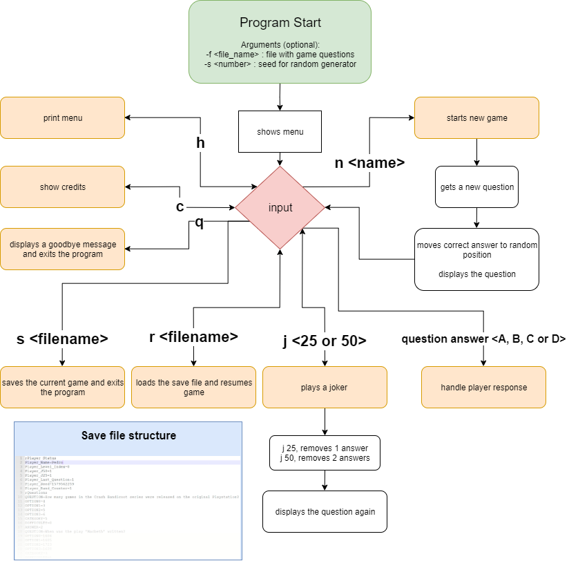

# Relatório Projeto Final - Cillionaire
#### Introdução à Computação
#### Licenciatura em Videojogos - Universidade Lusófona
#### 1º Semestre - 2019/2020

## Grupo
Nome : Sad4Cyberpunk

Autor
* Pedro Dias Marques - 21900800

## Descrição da Solução
O programa começa por mostrar o menu, com as seguintes opções:
* n *nome* -> começar um jogo novo. *nome* é opcional
* q -> fecha programa
* h -> volta a mostrar o menu
* r *nome_do_ficheiro* -> carrega o ficheiro com o nome fornecido para recomeçar a jogar onde o jogador parou numa sessão anterior
* s *nome_do_ficheiro* -> guarda um ficheiro com o nome fornecido para guardar a sessão atual
* j <25 ou 50> -> joga um *joker* que remove uma (joker 25) ou duas (joker 50) respostas possíveis
* c -> mostra os créditos do jogo

Cada *node* da lista de perguntas mantêm o endereço do elemento anterior e do próximo para facilitar o link *patching* ao remover perguntas.

Para manter consistência na randomização de números é guardado um contador de vezes que rand() é chamado. Esse número é guardado no *save file* e é usado ao carregar o ficheiro.

## Estrutura do Software

## Conclusões e Matéria Aprendida
Depois de terminar o projeto sinto-me muito mais à vontade a gerir memória dinâmica. Desenvolver este programa também foi uma boa desculpa para usar o software Valgrind pela primeira vez e familiarizar-me com as suas funcionalidades.

## Bibliotecas Utilizadas
Usei stdbool.h para poder usar tipo *boolean*
